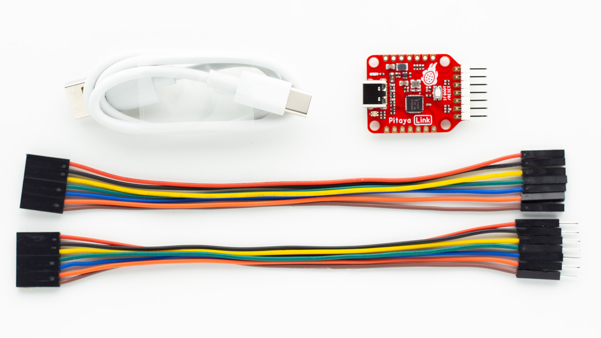
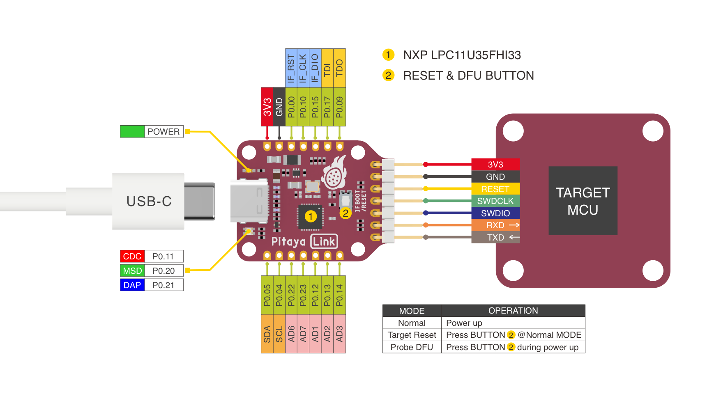

# Pitaya-Link

> An Open-Source CMSIS-DAP Debug Probe based on DAPLink

## Description

[**Pitaya-Link**](https://store.makerdiary.com/products/pitaya-link) is a low-cost debug probe based on the CMSIS-DAP (also known as [DAPLink](https://github.com/ARMmbed/DAPLink)) protocol standard. It can be used to program and debug the application software running on Arm Cortex Microcontrollers.

The design enables developers with Drag-And-Drop programming, Virtual COM Port, CMSIS-DAP compliant debug channel, and access to Arm Cortex Microcontrollers in the browser using [WebUSB](https://wicg.github.io/webusb/).

The probe comes with indicator LEDs, a button to reset the target or trigger the firmware update, reversible USB-C connector and easy-to-use 7-pin 2.54mm Header.

## Features

* NXP Semiconductors [LPC11U35FHI33](https://www.nxp.com/part/LPC11U35FHI33#/) microcontroller
	- 50 MHz Arm® Cortex-M0 processor
	- 64kB flash & 12kB SRAM
	- ROM-based USB drivers. Flash updates via USB supported.
* Shipped with [Arm Mbed DAPLink](https://github.com/ARMmbed/DAPLink) Firmware
	- MSC - drag-n-drop programming flash memory
	- CDC - virtual com port for log, trace and terminal emulation
	- HID - CMSIS-DAP compliant debug channel
	- WEBUSB HID - CMSIS-DAP compliant debug channel
* Supported by various IDEs and applications: [pyOCD](https://wiki.makerdiary.com/pitaya-link/pyocd), [DAP.js](https://wiki.makerdiary.com/pitaya-link/dapjs), [VS Code](https://wiki.makerdiary.com/pitaya-link/vscode), [KEIL MDK](https://wiki.makerdiary.com/pitaya-link/keil-mdk), [IAR](https://wiki.makerdiary.com/pitaya-link/iar-ewarm) etc.
* RGB LED indicator & Button
* 3.3V DC-DC regulator with 1A output current
* 3.3V Digital I/O Operating Voltage
* Reversible USB-C Connector
* Easy-to-use 7-pin 2.54mm Header with SWD & UART interface
* Very small form factor: 25 x 40 mm

## Hardware Diagram

## Included in the Box

|    **Part**               | **Qty** |
| ------------------------- | ------- |
| Pitaya-Link Board         | 1       |
| 7-pin Female/Male Cable   | 1       |
| 7-pin Female/Female Cable | 1       |
| USB-C Cable               | 1       |

## Tutorials

In order to help you use Pitaya-Link in your development environment, we have provided a series of tutorials. Find the details below:

* [Getting Started with Pitaya-Link](https://wiki.makerdiary.com/pitaya-link/getting-started)
* [Using Pitaya-Link with pyOCD](https://wiki.makerdiary.com/pitaya-link/pyocd)
* [Using Pitaya-Link with DAP.js](https://wiki.makerdiary.com/pitaya-link/dapjs)
* [Using Pitaya-Link with Visual Studio Code](https://wiki.makerdiary.com/pitaya-link/vscode)
* [Using Pitaya-Link with GNU MCU Eclipse](https://wiki.makerdiary.com/pitaya-link/eclipse)
* [Using Pitaya-Link with ARM KEIL MDK](https://wiki.makerdiary.com/pitaya-link/keil-mdk)
* [Using Pitaya-Link with IAR Embedded Workbench](https://wiki.makerdiary.com/pitaya-link/iar-ewarm)
* [Upgrading the DAPLink Firmware](https://wiki.makerdiary.com/pitaya-link/upgrading)
* [Building your own DAPLink Firmware](https://wiki.makerdiary.com/pitaya-link/building)

## Supported Targets

Pitaya-Link supports many popular microcontrollers. For a detailed list, please refer to: [Supported Target List](https://wiki.makerdiary.com/pitaya-link/supported-targets).

## Design Files

* [Pitaya-Link Hardware Diagram V1.0](docs/hw/pitaya-link_diagram_v1_0.pdf)
* [Pitaya-Link Schematic V1.0](docs/hw/pitaya-link_schematic_v1_0.pdf)
* [Pitaya-Link Board File V1.0](docs/hw/pitaya-link_board_file_v1_0.pdf)
* [Pitaya-Link 3D STEP V1.0](docs/hw/pitaya-link_3d_v1_0.step)

## Where to Buy

Pitaya-Link is available on the following channels (click to go directly to the product):

## Contributing

We would love for you to contribute to this project and help make it even better than it is today! See our [Contributing Guidelines](https://wiki.makerdiary.com/pitaya-link/CONTRIBUTING) for more information.

## License

**MIT License**

Copyright (c) 2020 [makerdiary](https://makerdiary.com)

Permission is hereby granted, free of charge, to any person obtaining a copy
of this software and associated documentation files (the "Software"), to deal
in the Software without restriction, including without limitation the rights
to use, copy, modify, merge, publish, distribute, sublicense, and/or sell
copies of the Software, and to permit persons to whom the Software is
furnished to do so, subject to the following conditions:

The above copyright notice and this permission notice shall be included in all
copies or substantial portions of the Software.

THE SOFTWARE IS PROVIDED "AS IS", WITHOUT WARRANTY OF ANY KIND, EXPRESS OR
IMPLIED, INCLUDING BUT NOT LIMITED TO THE WARRANTIES OF MERCHANTABILITY,
FITNESS FOR A PARTICULAR PURPOSE AND NONINFRINGEMENT. IN NO EVENT SHALL THE
AUTHORS OR COPYRIGHT HOLDERS BE LIABLE FOR ANY CLAIM, DAMAGES OR OTHER
LIABILITY, WHETHER IN AN ACTION OF CONTRACT, TORT OR OTHERWISE, ARISING FROM,
OUT OF OR IN CONNECTION WITH THE SOFTWARE OR THE USE OR OTHER DEALINGS IN THE
SOFTWARE.
