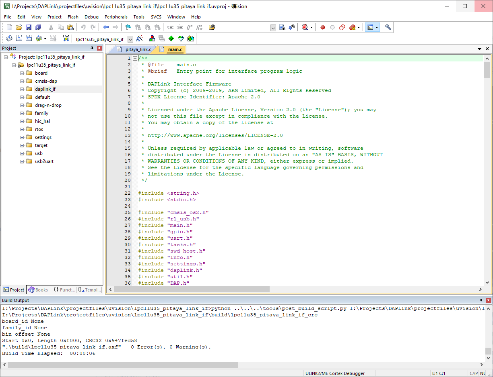

# Building your own DAPLink firmware

## Introduction

[Arm Mbed DAPLink](https://github.com/ARMmbed/DAPLink) is an open-source software project that enables programming and debugging application software running on Arm Cortex CPUs.

More features are planned and will show up gradually over time. The project is constantly under heavy development by Arm, its partners, numerous hardware vendors and the open-source community around the world. You are free to use and contribute. Enjoy!

For more detailed information, please refer to [DAPLink GitHub repository](https://github.com/ARMmbed/DAPLink).

This section describes how to set up a development environment and create a release build.

!!! note
	The following instructions only work on **Windows** computer.

## Set up prerequisites

Install the necessary tools listed below. Skip any step where a compatible tool already exists.

* Install [Python 2, 2.7.11 or above](https://www.python.org/downloads/). Add to PATH.
* Install [Git](https://git-scm.com/downloads). Add to PATH.
* Install [Keil MDK-ARM](https://www.keil.com/download/product/), preferably version 5.
	
	!!! note
		Set environment variable `UV4` to the absolute path of the UV4 executable if you don't install to the default location. Note that `UV4` is what's used for both MDK versions 4 and 5.

* Install `virtualenv` in your global Python installation eg: `pip install virtualenv`.

## Clone the sources

Get the sources and create a virtual environment:

``` sh
$ git clone https://github.com/makerdiary/DAPLink
$ cd DAPLink
$ pip install virtualenv
$ virtualenv venv
```

## Activate virtual environment

Activate the virtual environment and update requirements. This is necessary when you open a new shell.

``` sh
$ venv/Scripts/activate   (For Linux)
$ venv/Scripts/activate.bat   (For Windows)
$ pip install -r requirements.txt
```

## Generate MDK project files

Generate the Pitaya-Link project by running the following command:

``` sh
progen generate -f projects.yaml -p lpc11u35_pitaya_link_if -t uvision
```

The project files are located in the `projectfiles/uvision` directory.

!!! note
	This step **MUST** be done every time you pull new changes!

## Build the project

Change to the `projectfiles/uvision/lpc11u35_pitaya_link_if` directory, and open the project using Keil MDK-ARM. Click the <kbd>build</kbd> icon to build the project.

[](assets/images/buiding-daplink.png)

The new fimware is located in the `lpc11u35_pitaya_link_if/build` directory with the name `lpc11u35_pitaya_link_if_crc.bin`. 

Follow the [Upgrading Firmware](upgrading.md) section to upgrade.

## Reference

* [DAPLink Developers Guide](https://github.com/ARMmbed/DAPLink/blob/master/docs/DEVELOPERS-GUIDE.md)

## Create an Issue

Interested in contributing to this project? Want to report a bug? Feel free to click here:

<a href="https://github.com/makerdiary/pitaya-link/issues/new?title=Building%20DAPLink:%20%3Ctitle%3E"><button data-md-color-primary="red-bud"><i class="fa fa-github"></i> Create an Issue</button></a>

