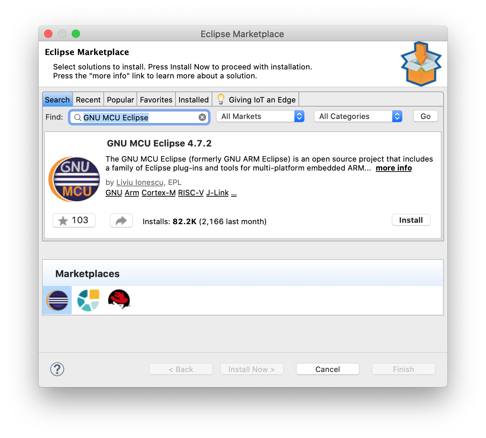
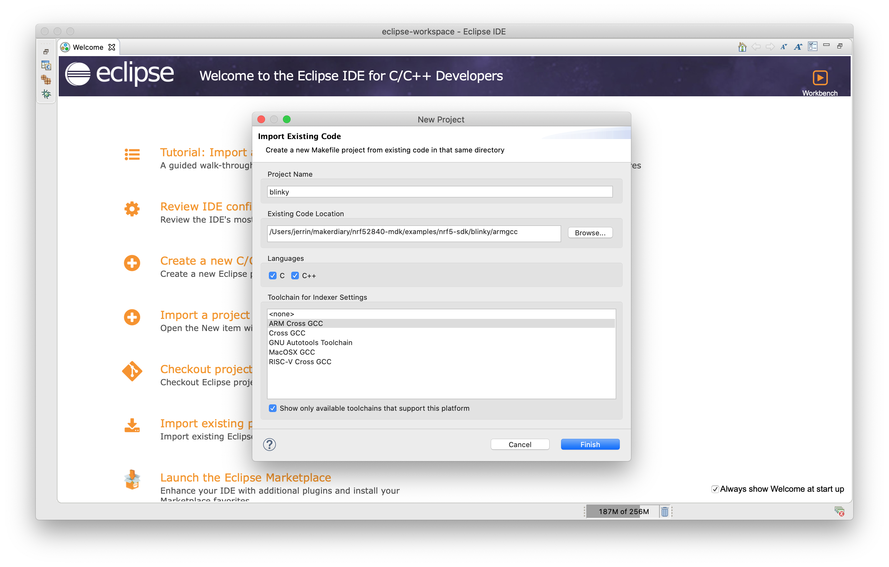
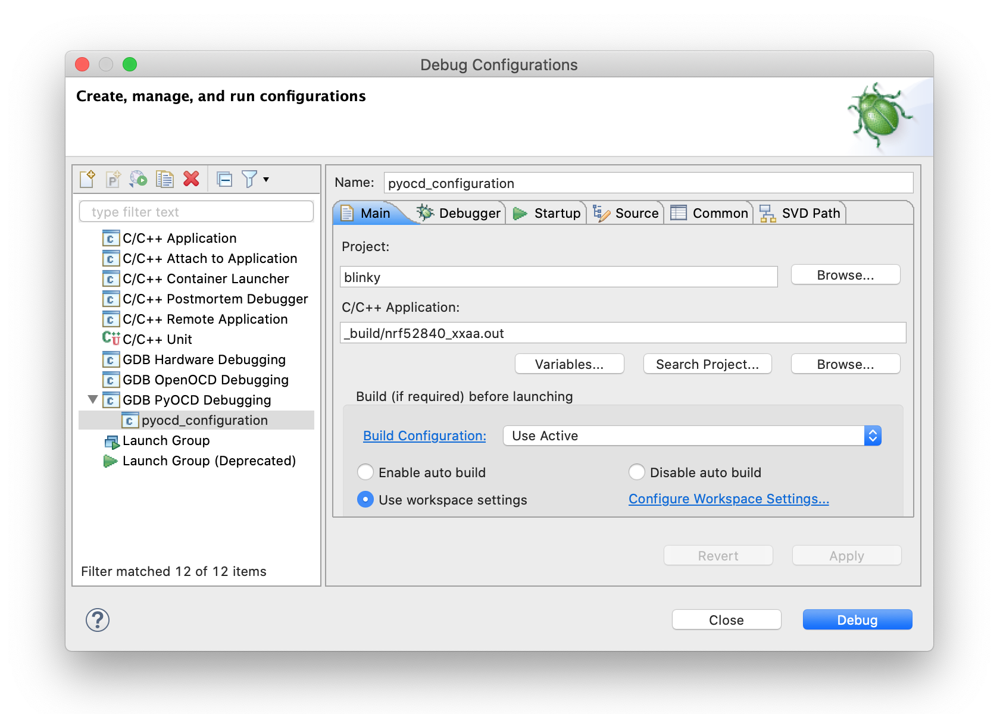
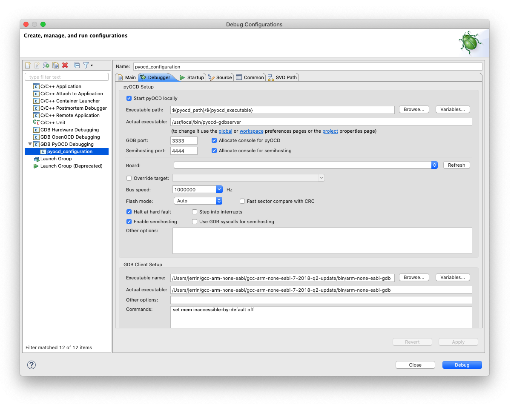
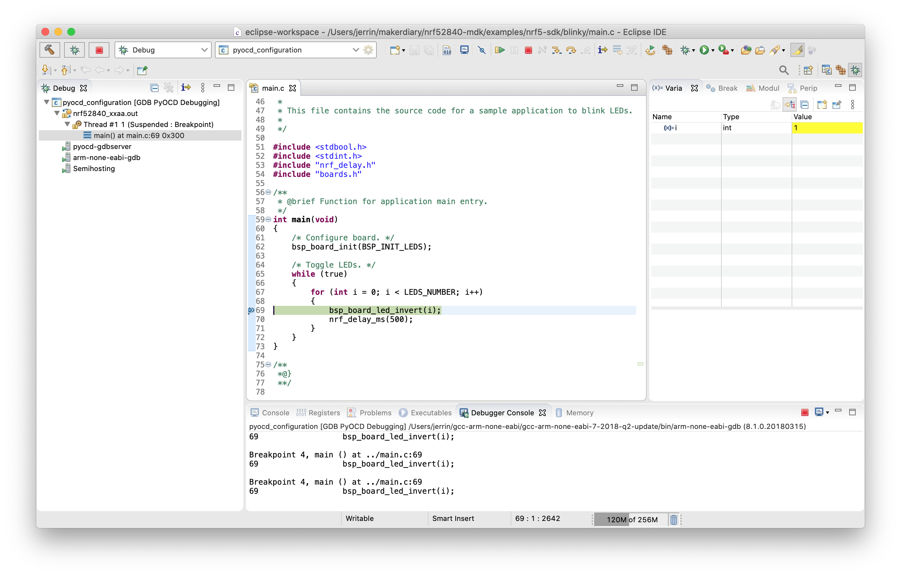

# Using Pitaya-Link with GNU MCU Eclipse

## Introduction

GNU MCU Eclipse fully supports pyOCD with an included pyOCD debugging plugin. This guide explains how to configure the local debug toolchain using Pitaya-Link with GNU MCU Eclipse.

## Requirements
* A [Pitaya-Link Debug Probe](https://store.makerdiary.com/products/pitaya-link)
* [Eclipse IDE for C/C++ Developers](http://www.eclipse.org/downloads/eclipse-packages/)
* An nRF52 target board (e.g. [nRF52840 MDK USB Dongle](https://store.makerdiary.com/products/nrf52840-mdk-usb-dongle))

## Installing Eclipse

You need to install Eclipse CDT with the GNU MCU Eclipse plugins to begin:

1. Install [Eclipse IDE for C/C++ Developers](http://www.eclipse.org/downloads/eclipse-packages/).
2. Open Eclipse.
3. Create a workspace directory. This will be separate from your code.
4. Install the GNU MCU Eclipse plugin:
	1. Click the **Help** menu item and select **Eclipse Marketplace…**
	2. Find **GNU MCU Eclipse** and install.
	3. Select **GNU MCU Eclipse x.x.x** and confirm.



## Install pyOCD

The latest stable version of pyOCD may be installed via [pip](https://pip.pypa.io/en/stable/index.html) as follows. **Skip** this step if pyOCD already exists.

``` sh
pip install -U pyocd
```

## Install GNU Arm Embedded Toolchain

Download and install the [GNU ARM Embedded Toolchain](https://developer.arm.com/open-source/gnu-toolchain/gnu-rm/downloads). **Skip** this step if the toolchain already exists.

## Importing the project in Eclipse
1. Open Eclipse.
2. On the *Welcome window*, select *Import a project with a working Makefile*.
3. Select the folder to your project with a Makefile. E.g., [blinky/armgcc](https://github.com/makerdiary/nrf52840-mdk/tree/master/examples/nrf5-sdk/blinky/armgcc).
4. Under *Toolchain for Indexer Settings*, select `Cross ARM GCC`.
5. Click *Finish*.



## Configuring the debugger

1. Select *Run* > *Debug Configurations...*.
2. If no configuration exists under *GDB pyOCD Debugging*, click on *New launch configuration*.
3. In the *Main* tab, select the `.out` file (`_build/nrf52840_xxaa.out`) under *C/C++ Application*.
	
	

4. In the *Debugger* tab:
	1. Under *pyOCD Setup*, set the *Executable* path and make sure that it is pointing to your latest version of the `pyocd-gdbserver`.
	2. Under *GDB Client Setup*, set the *Executable* path to your `arm-none-eabi-gdb`.
	3. Click *Apply*.

	[](assets/images/eclipse-debug-configuration_debugger.png)

!!! tip
	The `which`(on macOS/Linux) or `where`(on Windows) shell command can be used to find the location of `pyocd-gdbserver` and `arm-none-eabi-gdb`. E.g., `which pyocd-gdbserver` and `which arm-none-eabi-gdb`.

## Connecting the target

Perform the following steps to connect the target board:

1. Connect the target board to Pitaya-Link using the provided 7-pin Cable.
2. Connect Pitaya-Link to the PC using the provided USB-C Cable.


## Debugging your project
Click the menu <kbd>Run</kbd> -> <kbd>Debug</kbd>, and debugging starts. Click on the <kbd>Debugger Console</kbd> tab to see the debug output:

[](assets/images/eclipse-debugging.png)

## Create an Issue

Interested in contributing to this project? Want to report a bug? Feel free to click here:

<a href="https://github.com/makerdiary/pitaya-link/issues/new?title=Eclipse%20Usage:%20%3Ctitle%3E"><button data-md-color-primary="red-bud"><i class="fa fa-github"></i> Create an Issue</button></a>