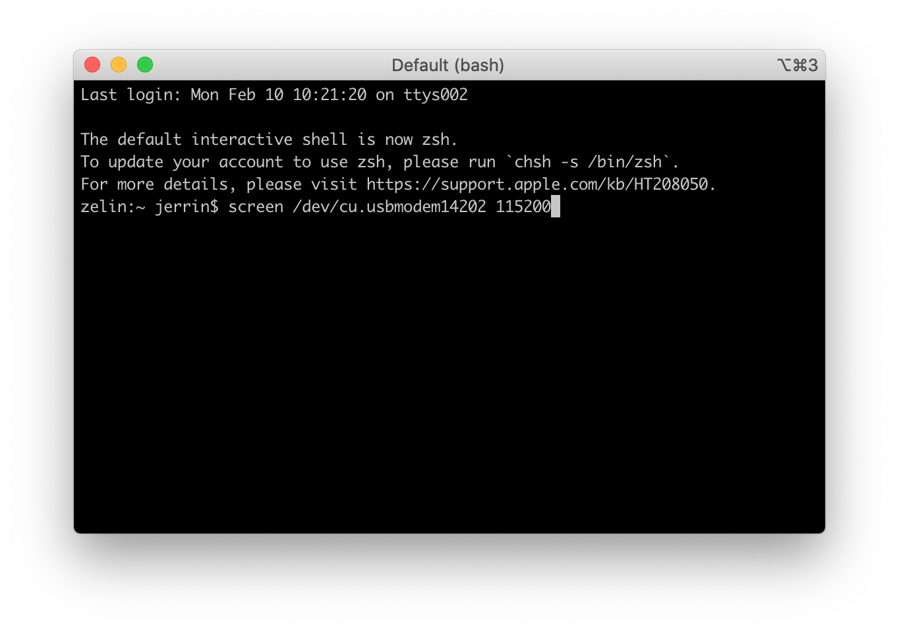
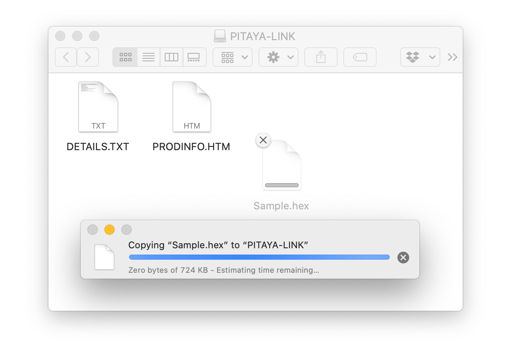

# Getting Started Out of the Box

## Introduction

This guide is intended to assist users in the initial setup and demonstration of the basic usage with Pitaya-Link:

* [Logging via Serial port](#logging-via-serial-port)
* [Drag-and-drop programming](#drag-and-drop-programming)
* [Programming via pyOCD](#programming-via-pyocd)


## What you'll need

* A [Pitaya-Link Debug Probe](https://store.makerdiary.com/products/pitaya-link)
* A macOS/Linux/Windows PC
* An nRF52 target board(e.g. [nRF52840 MDK USB Dongle](https://store.makerdiary.com/products/nrf52840-mdk-usb-dongle))

## Connect the target

Perform the following steps to connect the target board:

1. Connect the target board to Pitaya-Link using the provided 7-pin Cable.
2. Connect Pitaya-Link to the PC using the provided USB-C Cable.
3. A disk drive called **PITAYA-LINK** will be automatically detected by the computer.


## Logging via Serial port

Pitaya-Link enables developers with a Virtual COM Port which you can use for logging and reporting application state. 

There are many Terminal applications available for your host PC. They provide a window where your target can print messages. Select the tool according to your host:

* [screen](https://www.gnu.org/software/screen/manual/screen.html) (for macOS/Linux)
* [PuTTY](https://www.chiark.greenend.org.uk/~sgtatham/putty/) (for Windows)
* [CoolTerm](http://freeware.the-meiers.org/) (for macOS/Linux/Windows)



## Drag-and-drop programming

Drag-And-Drop is an optional intuitive programming feature. It allows programming of your target MCU in a very simple way: dragging and dropping a file (`.hex`-format) onto the **PITAYA-LINK** drive. 

There is no need to install application software. Anyone that can drag and drop a file to a USB memory stick can now program the target board.




!!! tip
	Upon completion, the drive remounts. If a failure occurs, the file `FAIL.TXT` appears on the drive containing information about the failure.

## Programming via pyOCD

[pyOCD](https://github.com/mbedmicro/pyOCD) is an open source Python package for programming and debugging Arm Cortex-M microcontrollers using multiple supported types of USB debug probes. It is fully cross-platform, with support for Linux, macOS, and Windows.

The latest stable version of pyOCD can be installed via [pip](https://pip.pypa.io/en/stable/index.html) as follows:

``` sh
pip install -U pyocd
```

Here is an example command showing how to flash an nRF52840-based target:
``` sh
pyocd flash -t nrf52840 Sample.hex
```

!!! tip
	For more instructions about using pyOCD, see [Usage with pyOCD](pyocd.md) section.


## Explore Further
Now that you are familiar with the Pitaya-Link, it's time to explore more tutorials available below:

* [Using Pitaya-Link with pyOCD](pyocd.md)
* [Using Pitaya-Link with DAP.js](dapjs.md)
* [Using Pitaya-Link with Visual Studio Code](vscode.md)
* [Using Pitaya-Link with GNU MCU Eclipse](eclipse.md)
* [Using Pitaya-Link with KEIL µVision IDE](keil-mdk.md)
* [Using Pitaya-Link with IAR Embedded Workbench](iar-ewarm.md)
* [Upgrading the DAPLink Firmware](upgrading.md)
* [Building your own DAPLink Firmware](building.md)

## Create an Issue

Interested in contributing to this project? Want to report a bug? Feel free to click here:

<a href="https://github.com/makerdiary/pitaya-link/issues/new?title=Getting%20Started:%20%3Ctitle%3E"><button data-md-color-primary="red-bud"><i class="fa fa-github"></i> Create an Issue</button></a>
