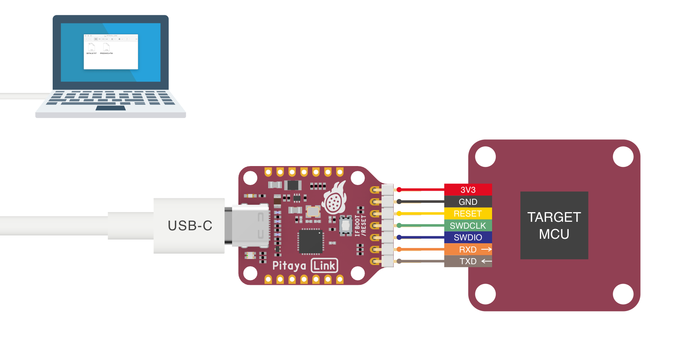
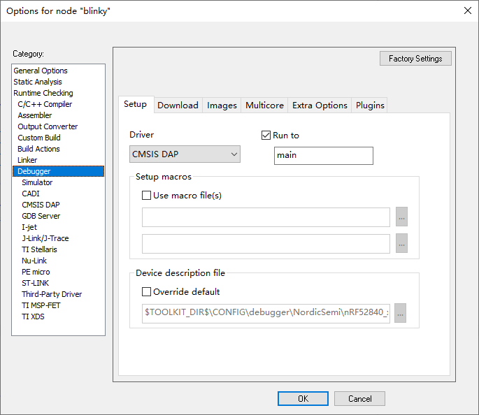
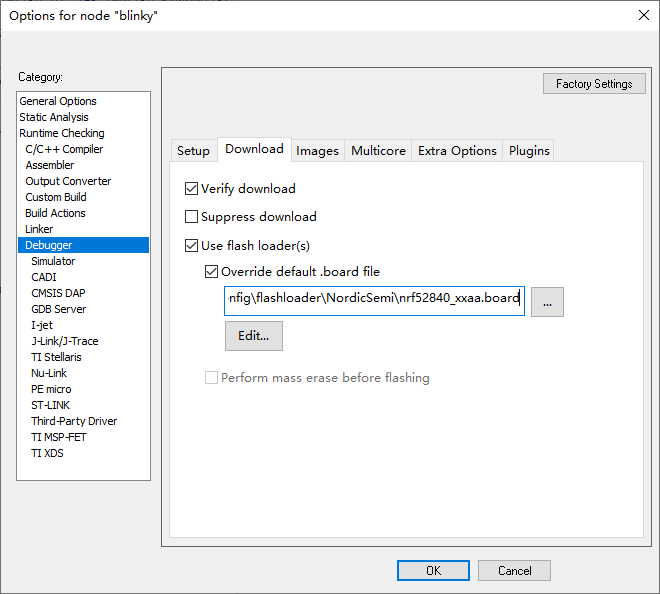
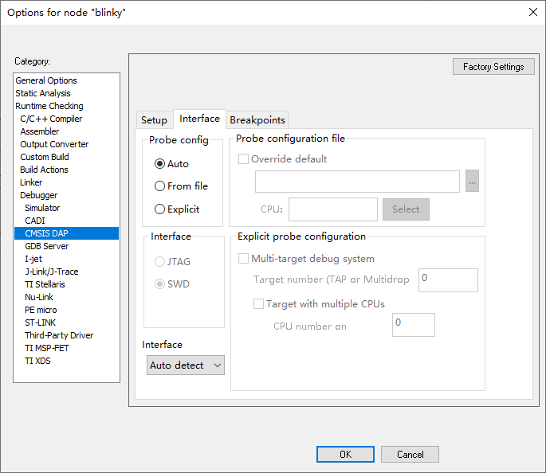
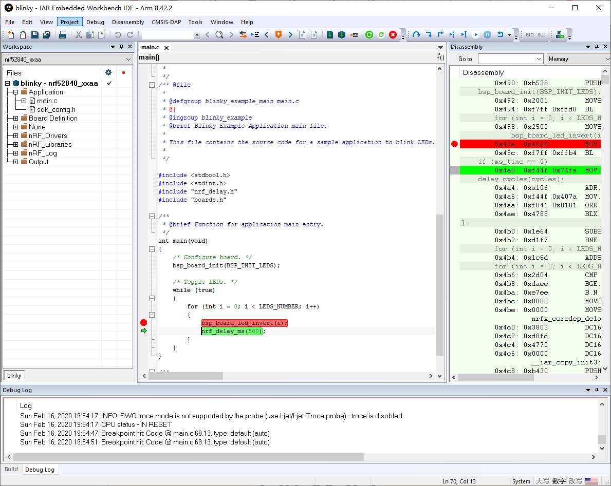

# Using Pitaya-Link with IAR Embedded Workbench

## Introduction

[IAR's EWARM](https://www.iar.com/iar-embedded-workbench/#!?architecture=Arm) is a completely integrated development environment that supports CMSIS-DAP out-of-the-box.

This guide explains how to configure the local debug toolchain using Pitaya-Link with IAR's EWARM.

## Requirements

* A [Pitaya-Link Debug Probe](https://store.makerdiary.com/products/pitaya-link)
* [IAR Embedded Workbench for ARM](https://www.iar.com/iar-embedded-workbench/#!?architecture=Arm)
* An nRF52 target board (e.g. [nRF52840 MDK USB Dongle](https://store.makerdiary.com/products/nrf52840-mdk-usb-dongle))

## Connecting the target

Perform the following steps to connect the target board:

1. Connect the target board to Pitaya-Link using the provided 7-pin Cable.
2. Connect Pitaya-Link to the PC using the provided USB-C Cable.

## Configuring the debugger

1. Open your IAR project.
2. Click *Options* from the *Project* menu.
3. In the option window, select *Debugger* from the menu on the left. In the *Setup* tab, select *CMSIS DAP* from the *Driver* drop-down menu.

	

4. In the *Download* tab, check *Verify download* and *Use flash loader(s)*. Make sure that the correct `.board` file is used.

	

5. Select *CMSIS DAP* from the menu on the left, select the *Interface* tab and configure the SWD protocol.

	

6. Click *OK* to save the options.

## Debugging your project

1. Insert a Breakpoint in your code. 
2. Click the menu *Project* -> *Download and Debug*, and debugging starts. 
3. Now you can explore IAR's debugging capabilities.

## Create an Issue

Interested in contributing to this project? Want to report a bug? Feel free to click here:

<a href="https://github.com/makerdiary/pitaya-link/issues/new?title=IAR%20Usage:%20%3Ctitle%3E"><button data-md-color-primary="red-bud"><i class="fa fa-github"></i> Create an Issue</button></a>