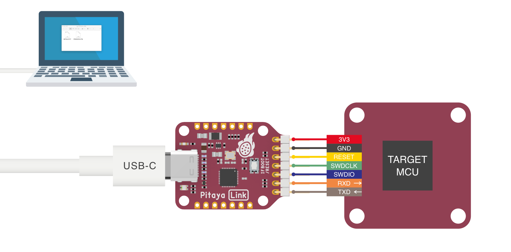
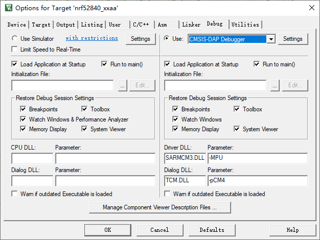

# Using Pitaya-Link with ARM KEIL MDK

## Introduction

[Keil MDK](http://www.keil.com/mdk5) is the complete software development environment for a wide range of Arm Cortex-M based microcontroller devices. MDK includes the µVision IDE and debugger, Arm C/C++ compiler, and essential middleware components. It supports all silicon vendors with more than 6,000 devices and is easy to learn and use.

This guide explains how to configure the local debug toolchain using Pitaya-Link with ARM KEIL MDK.

!!! note
	Due to the linker limits, this does not work in the free version of uVision. If you do not have a uVision license, you can use [Eclipse](eclipse.md) or [Visual Studio Code](vscode.md) instead.

## Requirements

* A [Pitaya-Link Debug Probe](https://store.makerdiary.com/products/pitaya-link)
* [ARM Keil MDK](http://www.keil.com/mdk5)
* An nRF52 target board (e.g. [nRF52840 MDK USB Dongle](https://store.makerdiary.com/products/nrf52840-mdk-usb-dongle))

## Connecting the target

Perform the following steps to connect the target board:

1. Connect the target board to Pitaya-Link using the provided 7-pin Cable.
2. Connect Pitaya-Link to the PC using the provided USB-C Cable.

## Configuring the debugger

1. Open your Keil MDK project.
2. Go to *Project* -> *Options for Target* -> *Debug*, and select *CMSIS-DAP Debugger* from the drop-down menu.
	
	

3. Click *Settings* button. In the next windows select the *DAPLink CMSIS-DAP* adapter. Set the *SW* mode. In the *SW Device*, you can view the target device.
	
	

4. Click *OK* to save the options.

## Debugging your project

1. Insert a Breakpoint in your code. 
2. Click the menu *Debug* -> *Start/Stop Debug Session*, and debugging starts. 
3. Now you can explore the debugging capabilities for Variables, Registers and more.

## Create an Issue

Interested in contributing to this project? Want to report a bug? Feel free to click here:

<a href="https://github.com/makerdiary/pitaya-link/issues/new?title=KEIL%20Usage:%20%3Ctitle%3E"><button data-md-color-primary="red-bud"><i class="fa fa-github"></i> Create an Issue</button></a>
