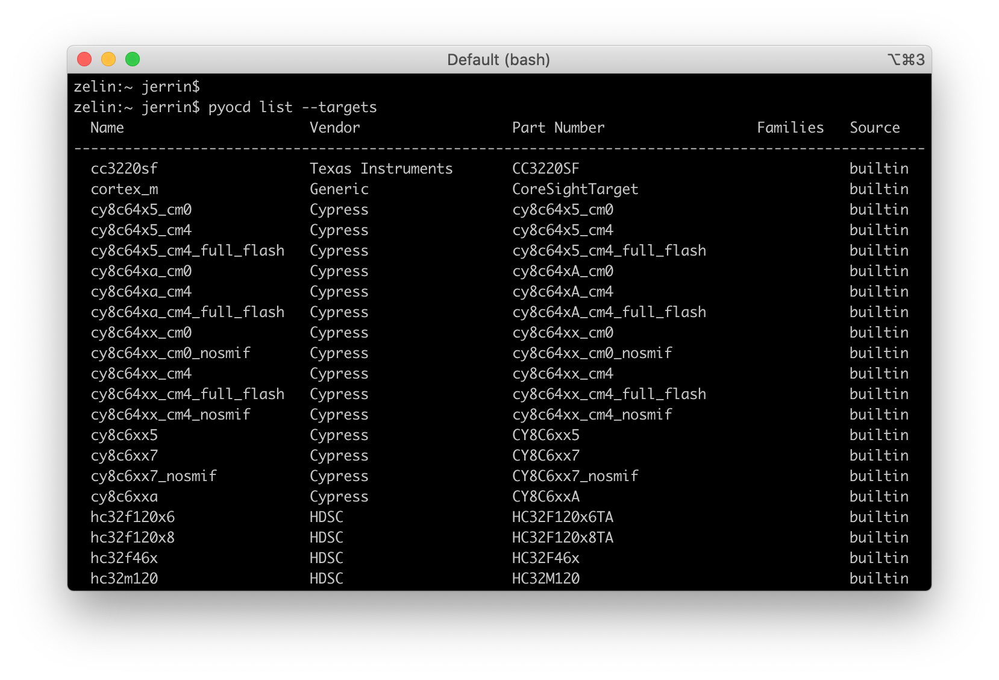
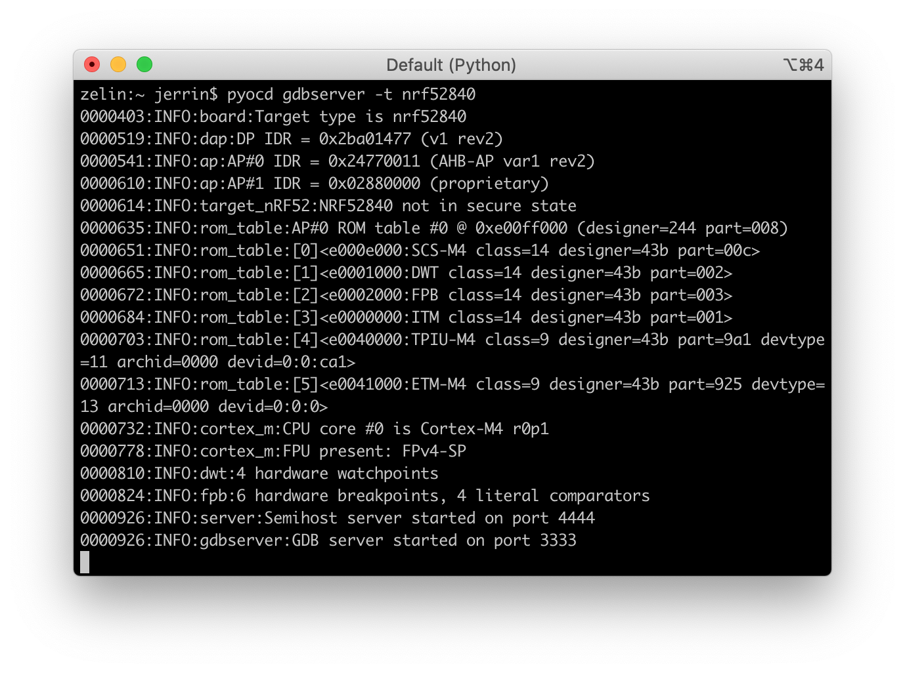

# Using Pitaya-Link with pyOCD

## Overview

[pyOCD](https://github.com/mbedmicro/pyOCD) is an open source Python package for programming and debugging Arm Cortex-M microcontrollers using multiple supported types of USB debug probes. It is fully cross-platform, with support for Linux, macOS, and Windows.

A command line tool is provided that covers most use cases, or you can make use of the Python API to enable low-level target control. A common use for the Python API is to run and control CI tests.

Upwards of 70 popular MCUs are supported built-in. In addition, through the use of CMSIS-Packs, nearly every Cortex-M device on the market is supported.

This guide demonstrates the basic usage of pyOCD with Pitaya-Link. For more detailed information, refer to the [pyOCD GitHub repository](https://github.com/mbedmicro/pyOCD).

## What you'll need

* A [Pitaya-Link Debug Probe](https://store.makerdiary.com/products/pitaya-link)
* A macOS/Linux/Windows PC
* An nRF52 target board(e.g. [nRF52840 MDK USB Dongle](https://store.makerdiary.com/products/nrf52840-mdk-usb-dongle))

## Installing

The latest stable version of pyOCD may be installed via [pip](https://pip.pypa.io/en/stable/index.html) as follows:

``` sh
pip install -U pyocd
```

Alternatively, to install the latest prerelease version from the HEAD of the master branch, you can do the following:

``` sh
pip install --pre -U https://github.com/mbedmicro/pyOCD/archive/master.zip
```

## Basic Usage

The `pyocd` command line tool gives you total control over your target with these subcommands:

* `gdbserver`: GDB remote server allows you to debug using gdb via either [GNU MCU Eclipse plug-in](https://gnu-mcu-eclipse.github.io/) or the console.
* `flash`: Program files of various formats into flash memory.
* `erase`: Erase part or all of an MCU's flash memory.
* `pack`: Manage [CMSIS Device Family Packs](http://arm-software.github.io/CMSIS_5/Pack/html/index.html) that provide additional target device support.
* `commander`: Interactive REPL control and inspection of the MCU.
* `list`: Show connected devices.

## Target support

When pyOCD connects to a target, it needs to know what type of target it is controlling. To see the available target types you can run:

``` sh
pyocd list --targets
```



## Programming

The flash programming may be the most frequently used option of Pitya-Link. pyOCD offers a variety of commands for programming with different options. You can get additional help by running:

``` sh
pyocd erase --help
pyocd flash --help
```

The following commands demonstrate how to flash/erase an nRF52840-based target:

* To erase all of the target flash:
	``` sh
	pyocd erase -t nrf52840 --chip
	```

* To flash the target with `.hex`-format firmware:
	``` sh
	pyocd flash -t nrf52840 Sample.hex
	```

* To flash the target with a plain binary:
	``` sh
	pyocd flash -t nrf52840 --base-address 0x1000 Sample.bin
	```

	!!! note
		The `--base-address` option is used for setting the address where to flash a binary. Defaults to start of flash.

## Debugging

pyOCD contains a GDB remote server which allows you to debug using gdb. You can get additional help by running: `pyocd gdbserver --help`.

You will be able to execute the following in order to start a GDB server:

``` sh
pyocd gdbserver -t nrf52840
```



In the second terminal window, connect to the GDB server and load firmware by running:

``` sh
$ arm-none-eabi-gdb application.elf

<gdb> target remote localhost:3333
<gdb> load
<gdb> monitor reset
```

The GDB server also works well with [Eclipse](https://www.eclipse.org/) and the [GNU MCU Eclipse plug-ins](https://gnu-mcu-eclipse.github.io/). GNU MCU Eclipse fully supports pyOCD with an included pyOCD debugging plugin.

For instructions on GNU MCU Eclipse for pyOCD, please refer to:

* [Using Pitaya-Link with GNU MCU Eclipse](eclipse.md)


## Create an Issue

Interested in contributing to this project? Want to report a bug? Feel free to click here:

<a href="https://github.com/makerdiary/pitaya-link/issues/new?title=pyOCD%20Usage:%20%3Ctitle%3E"><button data-md-color-primary="red-bud"><i class="fa fa-github"></i> Create an Issue</button></a>