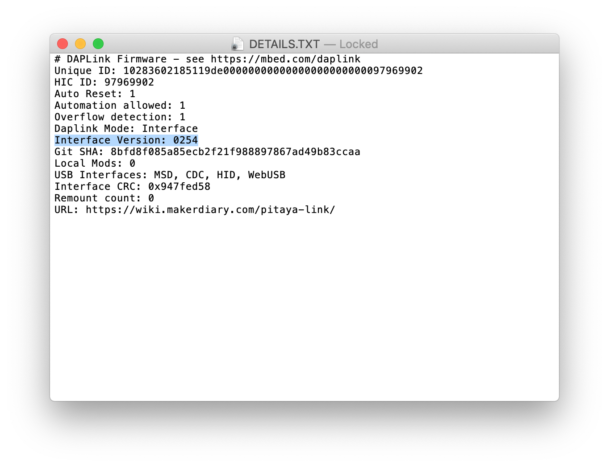

# Upgrading the DAPLink Firmware

## Introduction

Pitaya-Link can be easily upgraded via the on-chip bootloader software over USB. An update ensures you have the most recent features and improvements for your current version of DAPLink firmware. 

This section describes how to upgrade to the latest DAPLink firmware.

## Requirements
* [A Pitaya-Link Debug Probe](https://store.makerdiary.com/products/pitaya-link)
* macOS, Linux, or Windows 7 or newer
* 1x USB-C Cable

## Prepare the firmware

The current release DAPLink firmware is hosted on [GitHub Release Site](https://github.com/makerdiary/pitaya-link/releases) with the name `pitaya_link_<target>_if_crc_<version>.bin`.

<a href="https://github.com/makerdiary/pitaya-link/releases"><button data-md-color-primary="red-bud"><i class="fa fa-github"></i> Download</button></a>

## Update the firmware

To update the firmware, follow these steps:

1. Enter DFU mode by pressing DFU/RESET button during power up. The board should mount as a disk drive called **CRP DISABLD**.
2. Open **CRP DISABLD**, and remove the file called `firmware.bin`.
3. Copy the new firmware (`.bin`-format file prepared above) onto **CRP DISABLD**:
	* On Windows, replace `firmware.bin` with the new firmware.
	* On Linux/macOS, use `dd` command:
		``` sh
		dd if={new_firmware.bin} of={firmware.bin} conv=notrunc
		```
4. Unplug your Pitaya-Link, and plug it back in. It should now appear as a disk drive called **PITAYA-LINK**.

## Verify the update

Check the `DETAILS.TXT` file in **PITAYA-LINK** to verify the `Interface Version`.




## Create an Issue

Interested in contributing to this project? Want to report a bug? Feel free to click here:

<a href="https://github.com/makerdiary/pitaya-link/issues/new?title=Upgrading%20DAPLink:%20%3Ctitle%3E"><button data-md-color-primary="red-bud"><i class="fa fa-github"></i> Create an Issue</button></a>
